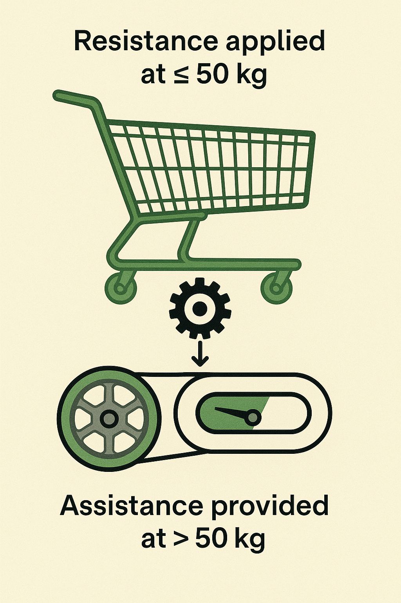

# 🛒 Solidarity Shopping Cart (aka Trolley) / Caddie Solidaire
*Roulez solidaire : un caddie intelligent qui partage l’énergie entre usagers.*

---

## 📖 Objectif

**Solidarity Shopping Cart (aka Trolley) / Caddie Solidaire** est un projet expérimental open hardware visant à transformer un simple chariot de supermarché en dispositif mécanique d’entraide :  
➡️ **L’idée : redistribuer l’énergie mécanique accumulée par des clients légers (petites courses) pour aider les clients chargés (grosses courses).**

💡 Ce projet explore les concepts suivants :
- Énergie mécanique stockée mécaniquement (ressorts, volant d’inertie),
- Assistance passive sans moteur ni batterie,
- Concept d’entraide invisible et contributive : "vous chargez légèrement, vous aidez beaucoup".

---

## ⚙️ Fonctionnement

Le système repose sur trois étapes simples :

1️⃣ **Accumulation d’énergie**  
Lorsqu’un caddie est poussé avec une charge ≤ 50 kg, une résistance douce est appliquée mécaniquement (ex : frein magnétique, ressorts).  
L’énergie fournie par le client est stockée dans un accumulateur mécanique intégré.

2️⃣ **Stockage passif**  
Un indicateur visuel (“jauge d’énergie solidaire”) montre le niveau d’énergie stockée disponible.  
Le caddie reste prêt pour aider le prochain utilisateur.

3️⃣ **Assistance à l’effort**  
Dès que le caddie dépasse 50 kg (chargé progressivement par un autre client), l’énergie emmagasinée est restituée :  
➡️ Moins d’effort pour pousser un caddie lourd.

---

## 🔋 Résumé énergétique

- ⚖️ **Poids moyen visé :** 50 kg
- 🔧 **Résistance appliquée :** modérée (~20 kg simulé max)
- 📦 **Énergie récupérée :** ~0,5–1 Wh par parcours “léger”
- 🎯 **Objectif :** assistance partielle mais perceptible (~100–300 m aidés)

---

## 🌍 Impact social & environnemental

Ce dispositif low-tech a une vocation avant tout humaine et symbolique :  
- 🤝 **Entraide mécanique discrète** entre utilisateurs successifs,
- 🌱 **Valorisation de l’énergie humaine habituellement perdue, sans électricité externe,**
- 🔧 **Approche simple et robuste**, adaptée aux environnements intensifs (hypermarchés).

---

## 📐 Documentation technique

👉 Retrouvez la documentation complète dans le dossier [`/docs`](./docs/) :

- [1️⃣ Concept mécanique](./docs/1-concept-mecanique.md)
- [2️⃣ Calculs énergétiques](./docs/3-calculs-energetiques.md)

---

## 📜 Licence

Ce projet est distribué sous **licence open hardware** pour usage non-commercial :
-   
  **[Creative Commons BY-NC-SA 4.0](https://creativecommons.org/licenses/by-nc-sa/4.0/)**

➡️ Pour un usage commercial ou industriel, veuillez consulter [`COMMERCIAL_LICENSE.md`](./governance/COMMERCIAL_LICENSE.md).

---

## ✍️ Contribuer

🔧 **Contributions bienvenues :**
- Retours d’expérience terrain,
- Suggestions sur le mécanisme mécanique,
- Tests de prototypes,
- Schémas alternatifs.

👉 Consultez [`CONTRIBUTING.md`](./CONTRIBUTING.md) pour savoir comment participer.

---

## ⚖️ Charte éthique

**Solidarity Shopping Cart (aka Trolley) / Caddie Solidaire** vise à :
- Promouvoir l’entraide simple et concrète,
- Respecter le confort des utilisateurs (résistance calibrée sans contrainte excessive).

---

## 📩 Contact

👤 **Auteur :** [f-buisson](https://github.com/f-buisson)  
📧 **Email :** [contact](mailto:scgfamp@hotmail.com)  
🕊️ **Année :** 2025

---

*“Et si chaque pas pouvait aider celui qui viendra après ?”*

---

# 🛒 Solidarity Shopping Cart (aka Trolley)
*Ride together: a smart cart that shares energy between users.*

---

## 📖 Purpose

**Solidarity Shopping Cart (aka Trolley)** is an experimental open hardware project that transforms a simple supermarket cart into a mechanical mutual aid device:  
➡️ **The idea: redistribute the mechanical energy provided by light-use customers (small purchases) to assist customers with heavy carts (big purchases).**

💡 This project explores the following concepts:
- Mechanical energy stored mechanically (springs, flywheel),
- Passive assistance with no motor or battery,
- Invisible, contributive solidarity: "You load a little, you help a lot."

---

## ⚙️ How it works

The system relies on three simple stages:

1️⃣ **Energy accumulation**  
When a cart is pushed with a load ≤ 50 kg, a mild mechanical resistance is applied (e.g., magnetic brake, springs).  
The energy provided by the customer is stored in an integrated mechanical accumulator.

2️⃣ **Passive storage**  
A visual indicator (“solidarity energy gauge”) shows the level of stored energy available.  
The cart remains ready to help the next user.

3️⃣ **Assistance**  
As soon as the cart exceeds 50 kg (progressively loaded by another customer), the stored energy is released:  
➡️ Less effort required to push a heavy cart.

---

## 🔋 Energy summary

- ⚖️ **Target average load:** 50 kg
- 🔧 **Applied resistance:** moderate (~20 kg simulated max)
- 📦 **Recovered energy:** ~0.5–1 Wh per “light-use” session
- 🎯 **Goal:** partial but noticeable assistance (~100–300 m helped)

---

## 🌍 Social & environmental impact

This low-tech device has a primarily human and symbolic purpose:
- 🤝 **Discreet mechanical solidarity** between successive users,
- 🌱 **Recovery of otherwise wasted human energy, no external electricity required,**
- 🔧 **Simple and robust design**, suitable for heavy-duty environments (supermarkets).

---

## 📐 Technical documentation

👉 Full documentation available in the [`/docs`](./docs/) folder:

- [1️⃣ Mechanical concept](./docs/1-concept-mecanique.md)
- [2️⃣ Principle diagram](./docs/2-schema-principe.md)
- [3️⃣ Energy calculations](./docs/3-calculs-energetiques.md)

---

## 📜 License

This project is released under **open hardware license for non-commercial use**:
-   
  **[Creative Commons BY-NC-SA 4.0](https://creativecommons.org/licenses/by-nc-sa/4.0/)**

➡️ For commercial or industrial use, please refer to [`COMMERCIAL_LICENSE.md`](./governance/COMMERCIAL_LICENSE.md).

---

## ✍️ Contributing

🔧 **Contributions welcome:**
- Field feedback,
- Suggestions on mechanical design,
- Prototype testing,
- Alternative diagrams.

👉 See [`CONTRIBUTING.md`](./CONTRIBUTING.md) for contribution details.

---

## ⚖️ Ethical charter

**Solidarity Shopping Cart (aka Trolley)** aims to:
- Promote simple and concrete mutual aid,
- Respect user comfort (calibrated resistance with no excessive constraint).

---

## 📩 Contact

👤 **Author:** [f-buisson](https://github.com/f-buisson)  
📧 **Email:** [contact](mailto:scgfamp@hotmail.com)  
🕊️ **Year:** 2025

---

*“What if every step could help the next person?”*
